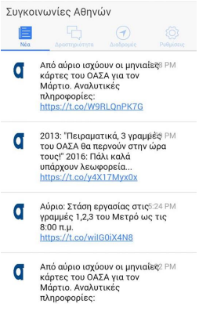
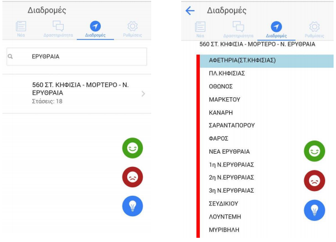
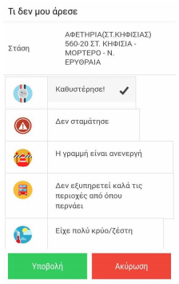
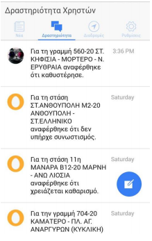

# Mobisense Project
Mobisense was developed as part of my M.Eng thesis at National Technical University of Athens, faculty of Electrical and Computer Engineering. It is a crowsourcing platform developed using:
- Meteor Framework 
- Angular JS and 
- MongoDB 

The scope is the development of a socail network based  application allowing public transport passenges to s hare organized and structured data on public transportation. Such shared information could lead to a better informed decision making by the usrrs about their own journeys and enable public transport operators to gather information about their service quality and therefore improve it. 

## Screenshots 
(Figure 1): The news are collected from OASA official page on Twitter using Twitter API.  

(Figure 2): A user can see posts(negative,positive or just ideas for improvement) from other users.  

(Figure 3): A user can search for the line we wants and by double clicking on the line he can get infos for all stops. He can also select to leave a negative or positive review for the selected line or stop.  

(Figure 4): While leaving reviews he can evaluate one of the default aspects of the service or submit a free text.

